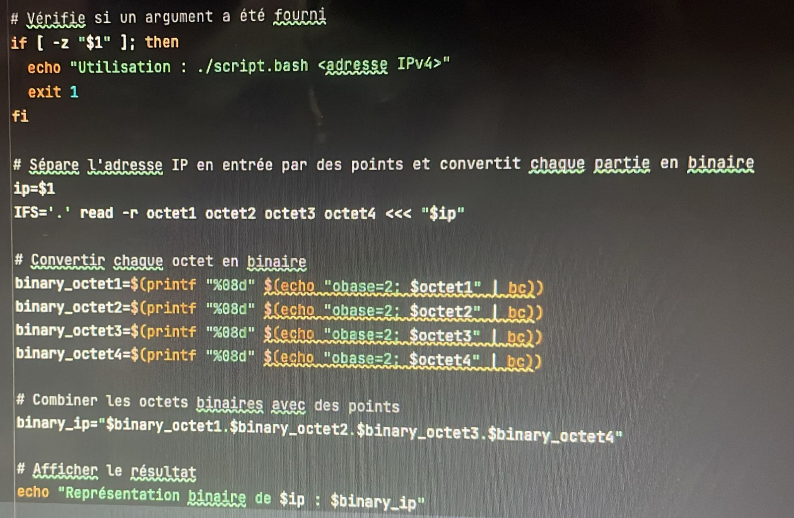
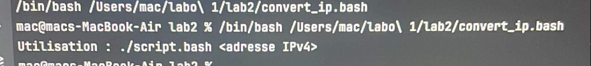
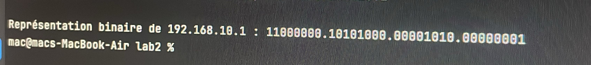

# Отчёт по лабораторной работе 2
## Описание скрипта
Описание скрипта
Скрипт convert_ip.bash принимает на вход IP-адрес в десятичном формате и преобразует его в двоичный формат. Скрипт использует команду read для разбиения IP-адреса на 4 части и команду bc для перевода каждой части в двоичное число.

Код скрипта

Этот скрипт принимает IP-адрес как аргумент командной строки и выводит его в двоичной форме.

Скрипт `convert_ip.bash`...

## Пример использования
...
Для IP-адреса 192.168.10.1, запуск скрип!та происходит следующим образом:

Результат выполнения:

## Заключение
...
Этот скрипт успешно преобразует любой IP-адрес из десятичного формата в двоичный. Он использует простые команды оболочки Bash, такие как read, для работы с IP-адресом, и bc для перевода десятичных чисел в двоичный формат.